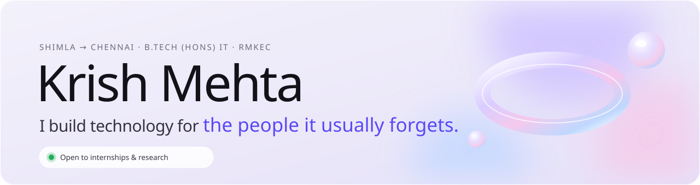
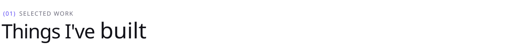
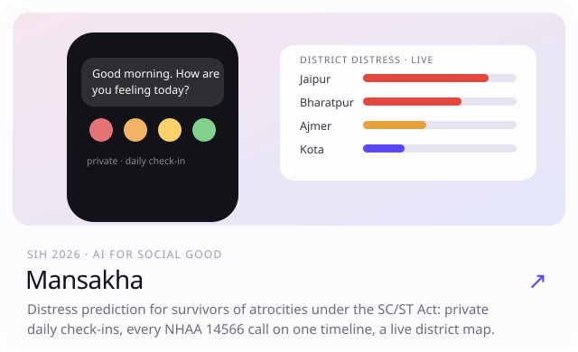
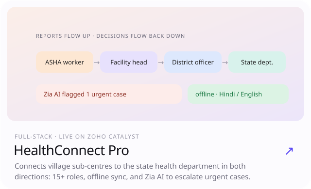
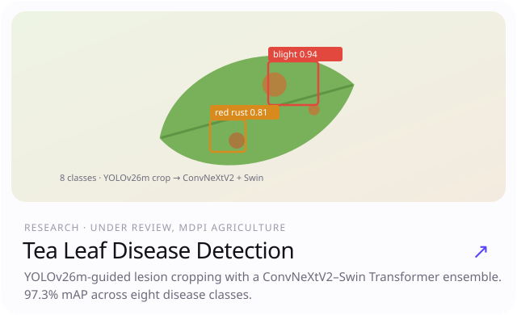
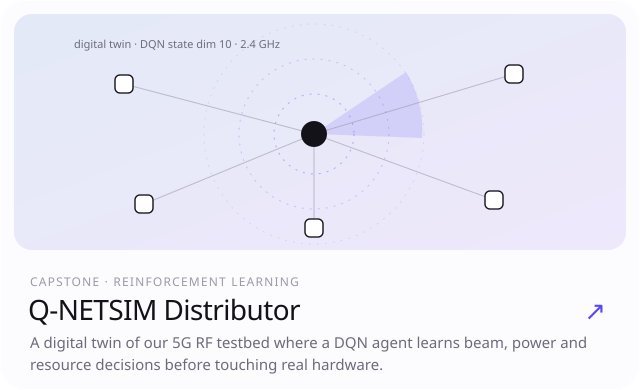
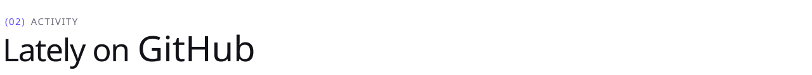
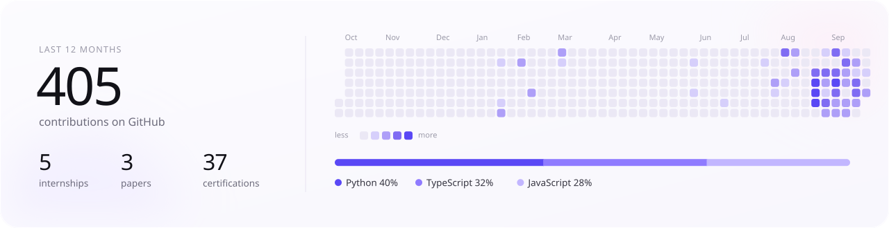
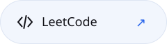

<picture><source media="(prefers-color-scheme: dark)" srcset="assets/hero-dark.svg"></picture>

Before I think about models or code, I ask who a tool is really for: a farmer who needs to catch leaf disease early, a health worker with one bar of signal, a survivor nobody checks on. The technical part comes second.

<picture><source media="(prefers-color-scheme: dark)" srcset="assets/h-work-dark.svg"></picture>

<a href="https://www.krishmehta.xyz/#work"><picture><source media="(prefers-color-scheme: dark)" srcset="assets/p-mansakha-dark.svg"></picture></a>
<a href="https://github.com/krish-mehta-01/healthconnect-pro"><picture><source media="(prefers-color-scheme: dark)" srcset="assets/p-healthconnect-dark.svg"></picture></a>
 
<a href="https://www.krishmehta.xyz/#research"><picture><source media="(prefers-color-scheme: dark)" srcset="assets/p-tealeaf-dark.svg"></picture></a>
<a href="https://www.krishmehta.xyz/#work"><picture><source media="(prefers-color-scheme: dark)" srcset="assets/p-qnetsim-dark.svg"></picture></a>
 

<picture><source media="(prefers-color-scheme: dark)" srcset="assets/h-activity-dark.svg"></picture>

<picture><source media="(prefers-color-scheme: dark)" srcset="assets/activity-dark.svg"></picture>

<a href="https://www.krishmehta.xyz"><picture><source media="(prefers-color-scheme: dark)" srcset="assets/b-website-dark.svg"></picture></a>
<a href="https://www.linkedin.com/in/-krish-mehta-01-05-/"><picture><source media="(prefers-color-scheme: dark)" srcset="assets/b-linkedin-dark.svg"></picture></a>
<a href="mailto:krish.mehta.0105@gmail.com"><picture><source media="(prefers-color-scheme: dark)" srcset="assets/b-email-dark.svg"></picture></a>
<a href="https://leetcode.com/u/_krish_mehta_/"><picture><source media="(prefers-color-scheme: dark)" srcset="assets/b-leetcode-dark.svg"></picture></a>

