<a href="https://www.krishmehta.xyz"><picture><source media="(prefers-color-scheme: dark)" srcset="assets/hero-dark.svg"></picture></a>

**I'm Krish: part curiosity, part chaos, fully dependable when it counts.**

My browser has more open tabs than my brain has excuses, I learn whatever the problem needs, and I'd rather laugh through a midnight deploy than panic through it. Easygoing most days. Locked in when it matters.

**Right now, quantitative trading excites me.** My latest project, [Mini NSE](https://github.com/krish-mehta-01/mini-nse), is a C++20 engine that reproduces how India's National Stock Exchange opens each morning (the pre-open call auction and the order book) and matches NSE's own opening price on 327 of 329 checks on real data. [Step through a trading morning →](https://krish-mehta-01.github.io/mini-nse/)

<picture><source media="(prefers-color-scheme: dark)" srcset="assets/h-skills-dark.svg"></picture>

<picture><source media="(prefers-color-scheme: dark)" srcset="assets/skills-dark.svg">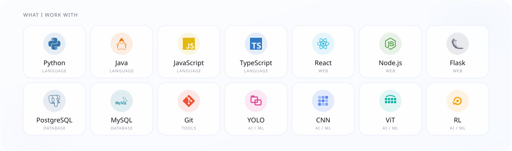</picture>

<picture><source media="(prefers-color-scheme: dark)" srcset="assets/h-heat-dark.svg">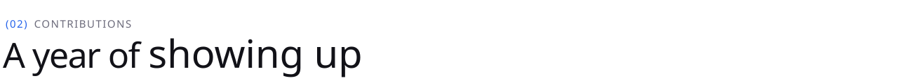</picture>

<picture><source media="(prefers-color-scheme: dark)" srcset="assets/heatmap-dark.svg">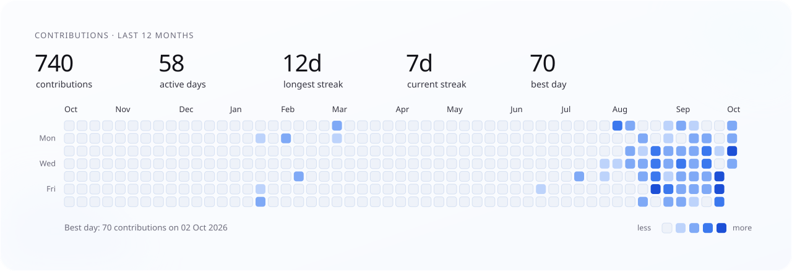</picture>

<picture><source media="(prefers-color-scheme: dark)" srcset="assets/h-lc-dark.svg"></picture>

<a href="https://leetcode.com/u/_krish_mehta_/"><picture><source media="(prefers-color-scheme: dark)" srcset="assets/leetcode-dark.svg">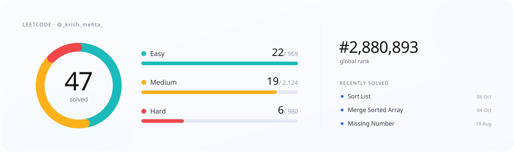</picture></a>

<picture><source media="(prefers-color-scheme: dark)" srcset="assets/h-contact-dark.svg"></picture>

<a href="mailto:krish.mehta.0105@gmail.com"><picture><source media="(prefers-color-scheme: dark)" srcset="assets/contact-dark.svg">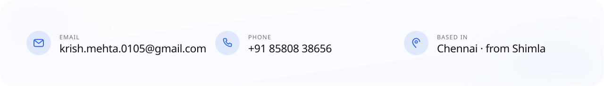</picture></a>

<a href="https://wa.me/918580838656"><picture><source media="(prefers-color-scheme: dark)" srcset="assets/c-whatsapp-dark.svg"></picture></a>
<a href="https://www.instagram.com/_krish_mehta_/"><picture><source media="(prefers-color-scheme: dark)" srcset="assets/c-instagram-dark.svg"></picture></a>
<a href="https://www.krishmehta.xyz/telegram"><picture><source media="(prefers-color-scheme: dark)" srcset="assets/c-telegram-dark.svg"></picture></a>
<a href="https://www.krishmehta.xyz/discord"><picture><source media="(prefers-color-scheme: dark)" srcset="assets/c-discord-dark.svg"></picture></a>
 
<a href="https://www.krishmehta.xyz"><picture><source media="(prefers-color-scheme: dark)" srcset="assets/b-portfolio-dark.svg"></picture></a>
<a href="https://www.linkedin.com/in/-krish-mehta-01-05-/"><picture><source media="(prefers-color-scheme: dark)" srcset="assets/b-linkedin-dark.svg"></picture></a>
<a href="mailto:krish.mehta.0105@gmail.com"><picture><source media="(prefers-color-scheme: dark)" srcset="assets/b-email-dark.svg"></picture></a>
<a href="https://leetcode.com/u/_krish_mehta_/"><picture><source media="(prefers-color-scheme: dark)" srcset="assets/b-leetcode-dark.svg"></picture></a>

<picture><source media="(prefers-color-scheme: dark)" srcset="assets/h-repos-dark.svg"></picture>

<a href="https://github.com/krish-mehta-01/mini-nse"><picture><source media="(prefers-color-scheme: dark)" srcset="assets/r-0-dark.svg">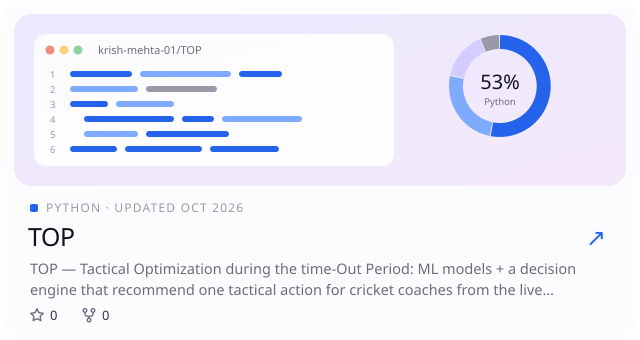</picture></a>
<a href="https://www.krishmehta.xyz/#work"><picture><source media="(prefers-color-scheme: dark)" srcset="assets/r-1-dark.svg">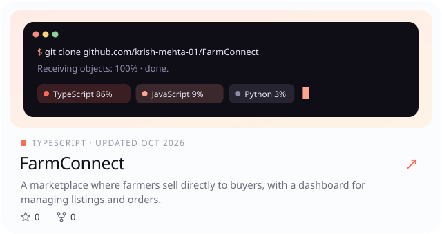</picture></a>
 
<a href="https://www.krishmehta.xyz/#work"><picture><source media="(prefers-color-scheme: dark)" srcset="assets/r-2-dark.svg">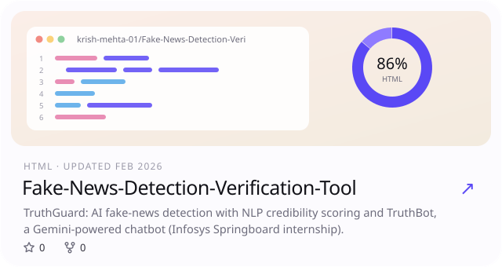</picture></a>
<a href="https://github.com/Ganga9115/Mansakha"><picture><source media="(prefers-color-scheme: dark)" srcset="assets/r-3-dark.svg">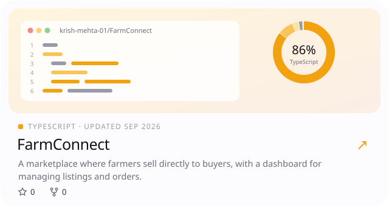</picture></a>
 

<b>Show all 14 repositories</b>

 

<a href="https://www.krishmehta.xyz/#work"><picture><source media="(prefers-color-scheme: dark)" srcset="assets/r-4-dark.svg">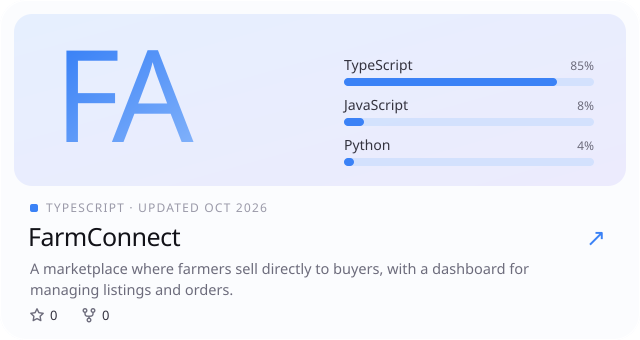</picture></a>
<a href="https://github.com/Dhanesh45/restora"><picture><source media="(prefers-color-scheme: dark)" srcset="assets/r-5-dark.svg">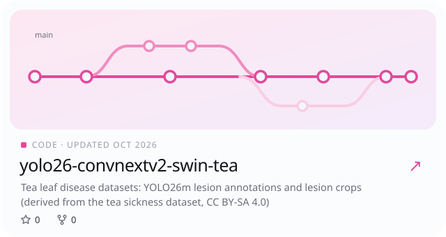</picture></a>
 
<a href="https://github.com/krish-mehta-01/LeetCode"><picture><source media="(prefers-color-scheme: dark)" srcset="assets/r-6-dark.svg">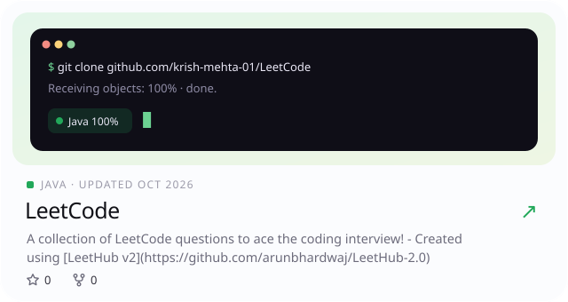</picture></a>
<a href="https://github.com/krish-mehta-01/yolo26-convnextv2-swin-tea"><picture><source media="(prefers-color-scheme: dark)" srcset="assets/r-7-dark.svg">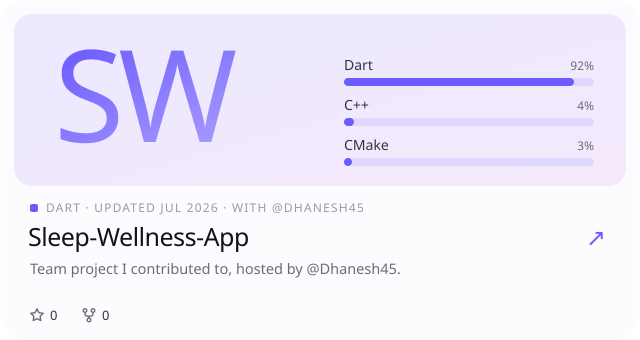</picture></a>
 
<a href="https://github.com/krish-mehta-01/Cognifyz-Technologies-Internship"><picture><source media="(prefers-color-scheme: dark)" srcset="assets/r-8-dark.svg">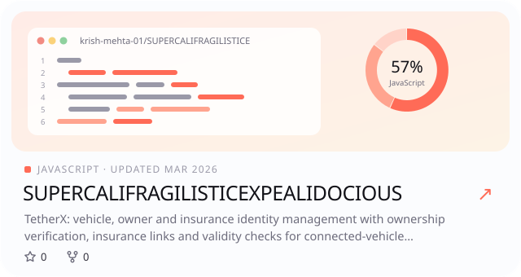</picture></a>
<a href="https://github.com/krish-mehta-01/Amdox-AI-Optimizer-Internship"><picture><source media="(prefers-color-scheme: dark)" srcset="assets/r-9-dark.svg">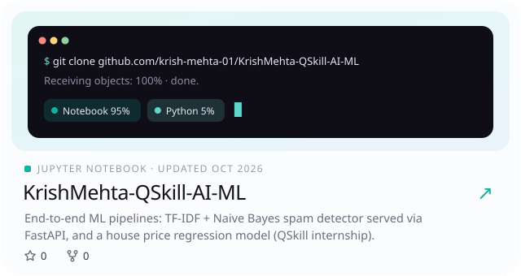</picture></a>
 
<a href="https://github.com/krish-mehta-01/Fake-News-Detection-Verification-Tool"><picture><source media="(prefers-color-scheme: dark)" srcset="assets/r-10-dark.svg">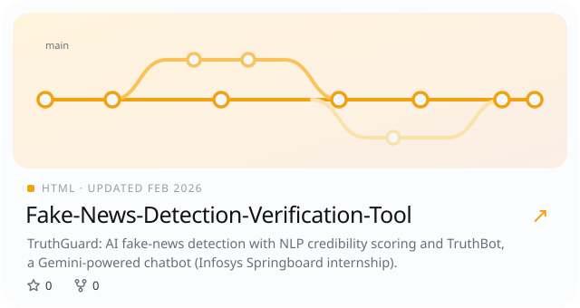</picture></a>
<a href="https://github.com/krish-mehta-01/KrishMehta-QSkill-AI-ML"><picture><source media="(prefers-color-scheme: dark)" srcset="assets/r-11-dark.svg">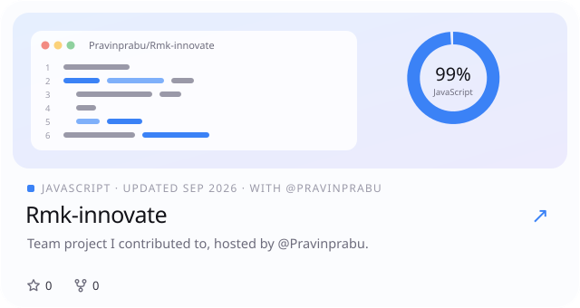</picture></a>
 
<a href="https://github.com/Pravinprabu/Rmk-innovate"><picture><source media="(prefers-color-scheme: dark)" srcset="assets/r-12-dark.svg">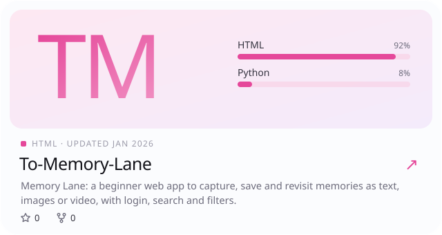</picture></a>
<a href="https://github.com/RithikRaja28/PragatiMitra-Application"><picture><source media="(prefers-color-scheme: dark)" srcset="assets/r-13-dark.svg">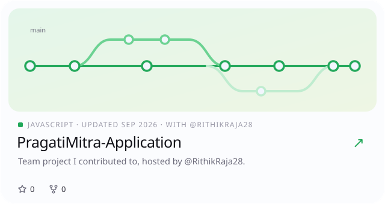</picture></a>
 

